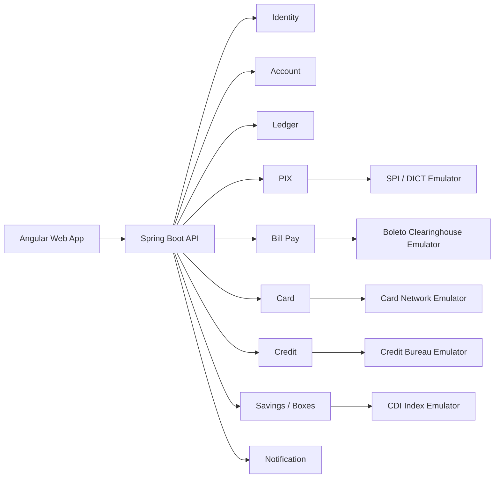
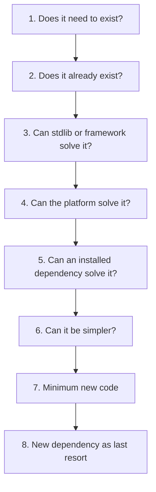

# RELAY Workflow Guide

> Engineering operations manual: agents, skills, states, evidence, and daily operation.
>
> Idioma / Language: [Português (pt-BR)](../pt-BR/WORKFLOW-GUIDE.md) · **English (en-US)** · [Back to project](../../../../README.md)

A web-based digital bank inspired by the experience of Brazilian neobanks. The product is
designed as a modular monolith with pragmatic DDD, Java, Spring Boot, Spring Modulith, and
Angular — and built by a delivery machine driven by specifications, evidence, and executable
gates.

This repository contains not only the product under construction, but also its source of truth:
vision, domain, architecture, roadmap, 17 specifications, decisions, and the **RELAY** workflow.
AI performs the technical work; humans decide product, accept risk, authorize sensitive
operations, and merge protected Pull Requests.

> **Transparency:** FKBANK is at the beginning of implementation. Its architecture, specs, and
> workflow are defined; MVP capabilities will now be delivered sprint by sprint. Planned items
> are presented as planned, never as completed.

---

## Table of contents

1. [Project status](#project-status)
2. [Product vision](#product-vision)
3. [Architecture](#architecture)
4. [Main stack](#main-stack)
5. [RELAY engineering workflow](#relay-engineering-workflow)
6. [Agents, skills, and evidence](#participants)
7. [Delivery tutorial](#delivery-tutorial--machine-first)
8. [CI, security, and releases](#ci)
9. [First steps](#first-steps)
10. [Documentation map](#documentation)
11. [License](#license)

## Project status

FKBANK is at the beginning of functional implementation. **RELAY**, the workflow governing
specifications, planning, implementation, QA, Pull Requests, security, releases, and human
decisions, is already installed and validated as the engineering baseline.

```text
Current state:
documentation baseline and RELAY workflow complete
→ Sprint 1 ready for execution
→ SPEC-0016 (observability)
→ SPEC-0001 (ledger)
→ SPEC-0002 (sign-up and account)
```

A feature is not considered delivered merely because code exists. Delivery is completed only after the applicable gates pass, a Pull Request is opened, human review occurs and the change is merged into the correct branch.

---

## Product vision

FKBANK will be a web banking application with an experience similar to a modern digital bank.

The MVP is organized around the following capabilities:

- registration and account opening;
- authentication and user profile;
- checking account;
- balance, statement and receipts;
- transaction PIN;
- internal transfers;
- high-fidelity simulated PIX;
- simulated boleto deposits and payments;
- virtual card;
- transaction limits;
- credit and personal loans;
- yield-bearing boxes;
- notifications;
- privacy and data lifecycle;
- observability, dashboards and alerting.

External systems are represented by deterministic emulators. The application core must not know whether it is talking to a real or simulated system; that distinction belongs to URLs and anti-corruption layers.

---

## Architecture

The project uses a **modular monolith**.



### Architecture principles

- exactly three backend root packages: `domain`, `application`, and `infra`;
- one module per bounded context below `domain`;
- acyclic dependencies: `application → domain` and `infra → domain`, never the reverse;
- delivery mechanisms in `application`; technical implementations in `infra`;
- DTOs only at the edges;
- aggregates never leave their module;
- JPA entities are never serialized directly;
- central ledger as the financial source of truth;
- balances derived from postings;
- idempotency for every money-moving route;
- explicit locks and transactions for concurrent operations;
- internal events through Spring Modulith;
- external integrations through ACLs;
- transactional outbox for outward events;
- default-deny security;
- observability from the walking skeleton;
- tests executed in the environment where the rule must actually hold.

---

## Main stack

### Backend

- Java 21;
- Spring Boot;
- Spring Modulith;
- Spring Data JPA;
- PostgreSQL;
- Flyway;
- Spring Security;
- OAuth2 / OIDC;
- springdoc-openapi;
- Micrometer;
- Testcontainers;
- JUnit 5;
- jqwik;
- ArchUnit;
- PIT.

### Frontend

- Angular;
- standalone components;
- zoneless change detection;
- signals;
- RxJS;
- PrimeNG;
- Tailwind CSS;
- Vitest;
- Playwright.

### Infrastructure and quality

- Docker Compose;
- GitHub Actions;
- Prometheus;
- Grafana;
- Loki;
- Alloy;
- gitleaks;
- CodeQL;
- Trivy (dependency, container and IaC scanning).

Dependabot is intentionally not used — see `docs/ARCHITECTURE.md` §Stack.

Exact versions and canonical decisions belong in `docs/ARCHITECTURE.md` and ADRs.

---

# RELAY engineering workflow

RELAY is the official delivery process for FKBANK.

It exists to prevent:

- marathon sessions;
- implementation without clear requirements;
- multiple agents modifying the same files;
- silent decisions;
- unnecessary dependencies;
- QA contaminated by implementation context;
- infinite automatic loops;
- AI-performed merges;
- context loss between sessions.

The operational model is a deterministic state machine. The user invokes one command; RELAY
advances automatically until it reaches a real external wait, material decision, or failure.

```mermaid
flowchart LR
    H[/deliver-spec or /deliver-sprint/] --> S[Validated spec]
    S --> D[Machine design]
    D --> B[Build]
    B --> Q[Isolated QA worker]
    Q --> P[Pull Request]
    P --> CI[Authoritative CI]
    CI --> R[PR review worker when required]
    R --> M[Human merge]
    M --> C[/close-sprint/]
    C --> SEC[Security Assurance worker when applicable]
    SEC --> REL[Release]
```



Each phase passes the baton through persistent artifacts:

```text
spec
→ plan
→ developer verification
→ QA report
→ Pull Request
→ CI
→ review report when required
→ human decision
→ Sprint closure and security report
```

Conversation memory is never the only source of context.

---

## Participants

RELAY defines specialized QA, PR review, and security responsibilities while Ultracode freely
chooses the workflow, team, subagent, parallel, and background topology:
`qa-engineer`, `pr-reviewer`, and `security-assurance-engineer`. The operator does not open or
coordinate separate worker sessions.

### Human operator

The operator is the final authority.

Only a human must:

- resolve material product or architecture ambiguity;
- decide functional ambiguity;
- approve a new dependency;
- approve a material architecture change;
- accept risk;
- merge;
- authorize a release;
- authorize an irreversible operation.

### Main agent and orchestrator

The normal Claude Code session is the orchestrator and the only active implementer. It advances
the state machine and orchestrates specialized responsibilities automatically.

Responsibilities:

- interview;
- specification;
- analysis;
- planning;
- implementation;
- TDD;
- developer-owned tests;
- fixes;
- documentation;
- commits;
- feature-branch push;
- Pull Request creation;
- initial CI observation.

### `qa-engineer`

Independent responsibility invoked automatically through Ultracode orchestration.

Responsibilities:

- acceptance tests;
- black-box API testing;
- contracts;
- E2E;
- errors;
- functional concurrency;
- resilience;
- evidence;
- test books.

QA never changes production code.

**The boundary lasts as long as the cycle, not forever.** While QA owns the work, the main agent
leaves QA's artifacts alone and a wrong QA test goes back to QA. Once QA's cycles are spent, or
QA hands back a finding it will not act on, the work has returned to the main agent — and the
main agent then owns every file, including QA's. It edits them directly under the `qa` role, so
the hook audit still records who wrote what, rather than leaving a known defect in the tree
because a boundary has no one on the other side.

What does not move is the independence of *verdicts*: the main agent never declares its own QA
verdict, and no orchestration may turn an independent worker's judgement into self-approval.

### `pr-reviewer`

Independent read-only responsibility invoked automatically when risk or evidence requires it.

Responsibilities:

- correctness;
- architecture;
- diff-level security;
- database concerns;
- contracts;
- tests;
- observability;
- risks;
- human review focus.

The reviewer does not edit, automatically comment, approve or merge.

### `security-assurance-engineer`

Independent final-delivery security worker invoked automatically by `/close-sprint` when the
Sprint contains R3/R4 work or policy otherwise requires it.

Responsibilities:

- threat-model reconciliation;
- SAST, secret, dependency, and license checks;
- authentication, authorization, and isolation verification;
- negative, DAST, and automated penetration checks in local/test environments;
- container and infrastructure checks;
- durable evidence for the exact candidate SHA.

The security worker never changes production code, targets production automatically, accepts
risk, weakens a gate, approves, publishes, or merges.

---

# Risk classification

The process grows with the risk of the change.

| Risk | Type | Examples |
|---|---|---|
| R0 | trivial | text, typo, comment, metadata |
| R1 | low | localized bug, small UI, reversible refactor |
| R2 | normal | common feature, backend + frontend, simple persistence |
| R3 | high | money, authorization, concurrency, migration, PII |
| R4 | critical | irreversibility, production, data deletion, regulatory impact |

## R0/R1 — Fast Track

Every versioned change has at least a **Light Spec**.

```text
/deliver-spec <id>
→ automatic lightweight design, build, verification, PR and CI
→ human review
→ human merge
```

## R2 — Standard Relay

```text
/deliver-spec <id>
→ automatic design and plan validation
→ build
→ isolated QA worker
→ PR and CI
→ review worker when triggered
→ human review
→ human merge
```

## R3/R4 — Critical Relay

```text
/deliver-spec <id>
→ durable design and plan validation
→ build
→ isolated QA worker
→ PR and CI
→ mandatory isolated review worker
→ human review
→ human merge
→ /close-sprint invokes security-assurance-engineer
→ release
```

---

# Decision Ladder

Before creating code, the agent follows this order:



The objective is not the smallest number of characters.

The objective is the smallest solution that remains:

- clear;
- correct;
- secure;
- testable;
- observable;
- consistent with the architecture.

A new production dependency requires human approval.

---

# Human Decision Gate

No material uncertainty may be resolved silently.

**An open question is never closed by the agent's own judgement, however well reasoned.** When a
question is genuinely open, the agent stops, asks the owner, and always states a recommendation.
Presenting options without recommending one pushes the work back onto the owner; deciding without
asking takes it away from them. The agent does both: facts, options with trade-offs, and the one
it would pick, with why.

Asking replaces deciding alone — it does not replace writing the answer down. Every answered
question is recorded durably: the spec's Decision Log, an ADR, the security document, the release
state, or the manual. A decision that was never recorded gets re-litigated; a decision that was
never asked about was never the agent's to make.

Applying a rule that is already written is not deciding an open question — it is reading. The
exemptions are unchanged and listed in `.claude/rules/human-decision-gate.md`.

The agent stops when there is:

- conflict between spec and domain;
- conflict between spec and ADR;
- incomplete rule;
- multiple valid interpretations;
- undefined timezone;
- undefined rounding;
- uncertain permission;
- unspecified error behavior;
- new dependency;
- structural change;
- scope expansion;
- destructive migration;
- public-contract change;
- unaccepted risk;
- irreversible operation.

State:

```text
HUMAN_DECISION_REQUIRED
```

The request must include:

- context;
- conflict;
- evidence;
- options;
- trade-offs;
- recommendation;
- impact of not deciding.

---

# Expected repository structure

```text
/
├── CLAUDE.md
├── README.md
├── docs/
│   ├── PRODUCT.md
│   ├── DOMAIN.md
│   ├── ARCHITECTURE.md
│   ├── ROADMAP.md
│   ├── CHANGELOG.md
│   ├── adr/
│   ├── specs/
│   ├── exec-plans/
│   ├── workflow/
│   ├── security/
│   ├── tests/
│   ├── qa/
│   ├── release-notes/
│   └── manual/
├── .claude/
│   ├── settings.json
│   ├── workflow-policy.yml
│   ├── agents/
│   ├── skills/
│   ├── rules/
│   ├── hooks/
│   ├── templates/
│   └── runtime/
├── tools/
│   ├── quality/
│   ├── workflow/
│   ├── git/
│   └── release/
├── backend/
│   └── src/main/java/com/fkbank/
│       ├── domain/        # bounded contexts, model, use cases, ports, events
│       ├── application/   # API, queue, stream, WebSocket, schedulers
│       └── infra/         # persistence, security, messaging, integrations, config
├── frontend/
├── emulators/
├── infra/                 # deployment/observability assets, not a Java package root
└── .github/
    └── workflows/
```

The actual structure may evolve, but material architecture changes require an ADR.

---

# Delivery tutorial — machine-first

Normal operation is a spec loop followed by one autonomous closeout:

```text
/deliver-spec <id>       # deliver one spec to human merge wait
/close-sprint <sprint>   # close, assure, prepare and finalize the Sprint release

# Optional, less common shortcut:
/deliver-sprint <sprint> # deliver every spec, then run the same complete closeout
```

The granular commands below are internal phase contracts and recovery entry points, not a
required operator ceremony.

## 1. Plan the Sprint

A Sprint is not an agent and does not begin with implementation.

Open a normal session and use a prompt such as:

```text
We are starting Sprint 1.

Business objective:
[describe the outcome]

Approximate capacity:
[e.g. 20 hours]

Analyze PRODUCT.md, DOMAIN.md, ARCHITECTURE.md, ROADMAP.md and the existing specs.

Do not implement.

I need:
1. candidate specs;
2. dependencies;
3. R0–R4 risk;
4. recommended order;
5. Sprint Goal;
6. items that do not fit;
7. specs that need splitting;
8. pending human decisions;
9. proposed Sprint commitment.

Do not assume missing rules.
```

The operator chooses the final commitment.

---

## 2. Create or review a spec

### Light Spec

```text
/spec --profile light

Fix the message shown when the user enters an invalid CPF.
Do not change the validation rule.
```

### Standard or Critical Spec

```text
/spec --profile critical

Implement internal transfers between FKBANK accounts with a PIN,
Idempotency-Key, receipts and safe concurrency.
Do not invent limits that have not been approved.
```

A spec ends in a known state:

```text
AWAITING_SPEC_INPUT
AWAITING_SPEC_APPROVAL
READY
HUMAN_DECISION_REQUIRED
BLOCKED
```

Invoking `/deliver-spec` explicitly approves the exact validated spec hash. An unresolved
material question still stops the machine.

---

## 3. Design an R2+ slice

```text
/design-slice 0007
```

Design must:

- read only the necessary context;
- execute the Decision Ladder;
- identify reuse;
- identify contracts;
- define the TDD sequence;
- define QA focus;
- identify risks;
- verify that the slice fits one session;
- propose a split when necessary;
- avoid changing production code.

When every decision is derived from the approved spec and architecture, the machine records
`PLAN_APPROVED` and continues. Only a new material choice stops.

---

## 4. Legacy/recovery plan approval

```text
/approve-plan 0007
```

This command is only for a legacy `AWAITING_PLAN_APPROVAL` state. Normal delivery does not ask
for a second approval. A recorded approval contains:

- date;
- operator;
- plan version;
- notes;
- decisions.

Result:

```text
PLAN_APPROVED
```

---

## 5. Build

Normal orchestration enters build automatically. For manual recovery:

```text
/build 0007
```

The builder must:

- create or validate the branch;
- use TDD;
- run focused tests;
- create coherent checkpoints;
- avoid reopening approved decisions without evidence;
- stop on material deviation;
- run final verification;
- create `dev-verification.md`.

Result:

```text
DEV_VERIFIED
```

### Branches

```text
chore/<id>-<slug>
bugfix/<id>-<slug>
feature/<id>-<slug>
release/<version>
hotfix/<version>-<slug>
```

Never implement directly on `develop` or `main`.

---

## 6. Run QA

`/deliver-spec` invokes the independent `qa-engineer` responsibility through its Ultracode workflow. `/qa`
is available only for recovery or diagnostics.

### Pass 1 — black box

QA tests the specification before reading the implementation.

### Pass 2 — white box

After freezing black-box results, QA reads the diff, tests and contracts.

Results:

```text
PASS
PASS_WITH_OBSERVATIONS
FAIL_REWORK
HUMAN_DECISION_REQUIRED
BLOCKED
```

### Rework

On `FAIL_REWORK`, orchestration runs the bounded rework automatically and invokes QA once more.

A second failure ends automation:

```text
BLOCKED
```

---

## 7. Open a Pull Request

After QA:

```text
/pr 0007
```

The skill runs:

- pre-PR DoD;
- documentation update;
- changelog;
- push;
- Pull Request creation;
- bounded CI observation;
- post-PR DoD.

Possible states:

```text
PR_OPEN
CI_PENDING
CI_FAILED
AWAITING_HUMAN_REVIEW
HUMAN_DECISION_REQUIRED
BLOCKED
```

---

## 8. Review the Pull Request

For R3/R4, `/deliver-spec` invokes the isolated read-only reviewer automatically. For lower
risk it is triggered by policy or evidence. `/review-pr` remains a recovery entry point.

The automated report does not replace human review.

---

## 9. Merge

Merge is always performed by a human.

Before merging:

- CI is green;
- QA is acceptable;
- findings were evaluated;
- documentation is coherent;
- decisions are recorded;
- limitations are explicit;
- rollback is understood.

After the human merge, the delivery closeout is automatic. The next `/deliver-spec` invocation — or
`/close-sprint` / `/release` for a Sprint's last slice — begins by sweeping any prior slice that is
merged but not yet reconciled: it flips the spec frontmatter to `IMPLEMENTED` with `implemented_at`
set to the real merge instant, ticks the `docs/ROADMAP.md` row to `Done ☑` with `Completed`, and
moves the durable plan from `docs/exec-plans/active/` to `docs/exec-plans/completed/`.
`/reconcile-workflow` is retained only as a manual fallback — for the final slice, out-of-band
deliveries, or correcting drift:

```text
/reconcile-workflow 0007
```

---

# CI

CI is the authority for deterministic gates.

Expected gates:

- backend build;
- tests;
- ArchUnit;
- coverage;
- mutation testing when applicable;
- OpenAPI drift;
- frontend lint;
- frontend tests;
- frontend build;
- E2E;
- gitleaks;
- CodeQL;
- dependency checks.

A gate that does not exist yet must be declared:

```text
PLANNED
```

or:

```text
NOT_APPLICABLE
```

Never passed.

---

# Releases

During development:

```text
1.5.0-SNAPSHOT
```

At release:

```text
1.5.0
```

After release:

```text
1.6.0-SNAPSHOT
```

Features do not change the application version.

## Prepare a release

```text
/release 1.5.0
```

Flow:

```text
develop
→ release branch
→ release version
→ changelog
→ release notes
→ verify-release
→ PR to main
→ human merge
```

## Finalize a release

After merge to `main`:

```text
/release 1.5.0
```

Finalization:

- verifies the SHA;
- creates the tag;
- creates the GitHub Release;
- advances to the next SNAPSHOT;
- opens the synchronization PR to `develop`.

---

# Hotfix

A hotfix starts from `main`, but still follows phases and gates.

```text
scope
→ build
→ applicable QA
→ PR to main
→ human merge
→ tag/release
→ synchronization PR
```

No skill crosses a human merge.

A critical hotfix never receives `SECURITY_VERIFIED` from risk acceptance alone.

---

# RELAY commands

| Command | Purpose |
|---|---|
| `/deliver-spec` | first auto-reconciles any prior merged-but-unreconciled slice, then advances one spec automatically to the human merge wait |
| `/deliver-sprint` | optional whole-Sprint loop: advances all committed specs, then runs `/close-sprint` internally |
| `/close-sprint` | normal post-spec command: reconciles, closes, assures, prepares and finalizes the release; resume the same command after protected-branch merge waits |
| `/security-assurance` | internal/recovery entry for the heavy security worker |
| `/spec` | creates or refines a specification |
| `/design-slice` | creates the slice plan |
| `/approve-plan` | recovery only for a persisted legacy `AWAITING_PLAN_APPROVAL` state |
| `/build` | implements and verifies |
| `/qa` | runs independent QA |
| `/pr` | prepares and opens a Pull Request |
| `/review-pr` | reviews a PR in read-only mode |
| `/fix-pr` | performs one correction round |
| `/release` | expert/support entry for out-of-band releases; routine Sprint release is internal to `/close-sprint` |
| `/hotfix` | conducts a staged hotfix |
| `/workflow-status` | reads workflow state |
| `/reconcile-workflow` | manual fallback that reconciles the final slice or any drift; routine closeout runs automatically at the next `/deliver-spec`, `/close-sprint` or `/release` |
| `/adr` | records an architecture decision |
| `/spike` | runs a timeboxed investigation |
| `/impact` | runs bounded read-only analysis |

---

# Main states

The normal machine-first path uses the states below. `AWAITING_PLAN_APPROVAL` exists only for
legacy-state recovery through `/approve-plan`; new executions validate derived plans
automatically and may emit `PLAN_APPROVED` without a human ceremony.

```text
DRAFT
AWAITING_SPEC_INPUT
AWAITING_SPEC_APPROVAL
READY
DESIGNING
PLAN_APPROVED
BUILDING
DEV_VERIFIED
QA_RUNNING
QA_VERIFIED
QA_OBSERVATIONS
QA_REWORK
PR_PREPARING
PR_OPEN
CI_PENDING
CI_FAILED
AWAITING_HUMAN_REVIEW
REVIEW_PASSED
REVIEW_FINDINGS
AWAITING_HUMAN_MERGE
SPRINT_DELIVERED
SPRINT_CLOSED
SECURITY_NOT_APPLICABLE
SECURITY_VERIFIED
SECURITY_OBSERVATIONS
AWAITING_RISK_ACCEPTANCE
AWAITING_PRODUCTION_AUTHORIZATION
EXTERNAL_SYSTEM_UNAVAILABLE
HUMAN_DECISION_REQUIRED
BLOCKED
```

Every transition records state and evidence. Normal orchestration continues automatically.

Example:

```text
AWAITING_HUMAN_MERGE
resume: /deliver-spec 0007 --resume
```

---

# Querying state

```text
/workflow-status
```

or:

```text
/workflow-status 0007
```

Status should show:

- spec;
- risk;
- phase;
- branch;
- PR;
- QA;
- CI;
- pending decisions;
- next command.

---

# Hard stop

The flow stops when:

- the same failure repeats;
- QA fails a second time;
- CI fails again after the allowed correction;
- the spec is ambiguous;
- sources conflict;
- the plan does not fit one session;
- a structural change is not approved;
- an operation is irreversible;
- a required gate cannot be executed.

The result is a Block Report, not an infinite attempt loop.

---

# Sprint closure

At the end of a Sprint run `/close-sprint <sprint>`. This is the only routine post-spec command. It
sweeps any merged-but-unreconciled slice —
the Sprint's last-slice edge, which has no later `/deliver-spec` to trigger it — into `IMPLEMENTED`
at the real merge instant (ROADMAP `Done ☑` + `Completed`, durable plan moved to
`docs/exec-plans/completed/`), reconciles evidence, runs release verification, invokes Security
Assurance automatically when applicable, writes a concise durable closure report, prepares the
release and continues through finalization. It never hands the operator off to `/release`.
Protected-branch merges remain human-only; resume the same `/close-sprint` command afterward.
The report records auditable outcomes and exceptions, not a mandatory phase diary or token log.

```text
We are closing the Sprint.

Analyze:
- Sprint Goal;
- committed specs;
- merges to develop;
- open PRs;
- QA;
- CI;
- bugs;
- rework;
- decisions;
- blockers or waived gates.

Produce:
1. goal achieved or not;
2. completed items;
3. incomplete items;
4. proposed carry-over;
5. findings;
6. verification and Security Assurance verdict.
```

A spec is delivered only after it is merged with the applicable gates.

---

# 20% rule

A step must be reviewed when:

```text
median overhead > 20%
and
no measurable improvement in quality, risk or rework
```

The workflow is mandatory, but not immutable. Changes require evidence and approval.

---

# First steps

After cloning the project:

1. read `CLAUDE.md`;
2. read `docs/workflow/SETUP.md`;
3. run smoke tests;
4. review `PRODUCT.md`;
5. review `DOMAIN.md`;
6. review `ARCHITECTURE.md`;
7. resolve pending human decisions;
8. approve the first spec;
9. plan the Sprint;
10. start the first approved slice.

On Windows:

```powershell
powershell.exe -NoProfile -ExecutionPolicy Bypass -File tools/tests/relay-smoke.ps1
```

On Linux/macOS:

```bash
timeout 300 tools/tests/relay-smoke.sh
```

Do not begin a Sprint if smoke tests fail.

---

# Documentation

| Document | Role |
|---|---|
| `CLAUDE.md` | permanent agent rules |
| `docs/PRODUCT.md` | product vision and scope |
| `docs/DOMAIN.md` | domain language and invariants |
| `docs/ARCHITECTURE.md` | approved architecture |
| `docs/ROADMAP.md` | likely capability order |
| `docs/specs/` | feature behavior |
| `docs/adr/` | architecture decisions |
| `docs/workflow/` | workflow and reports |
| `docs/security/` | Security Assurance |
| `docs/manual/` | user manual |
| `docs/release-notes/` | release notes |

---

# Contributing

This project is developed with AI assistance, but responsibility, decisions and merges remain human.

Before changing code:

- a spec exists;
- a branch exists;
- risk is classified;
- the plan is approved when applicable;
- no material decisions are pending.

Before opening a PR:

- tests pass;
- verification is recorded;
- applicable QA was executed;
- documentation was updated;
- limitations are explicit.

---

# License

This project is released under the [BSD Zero Clause License (0BSD)](../../../../LICENSE).
