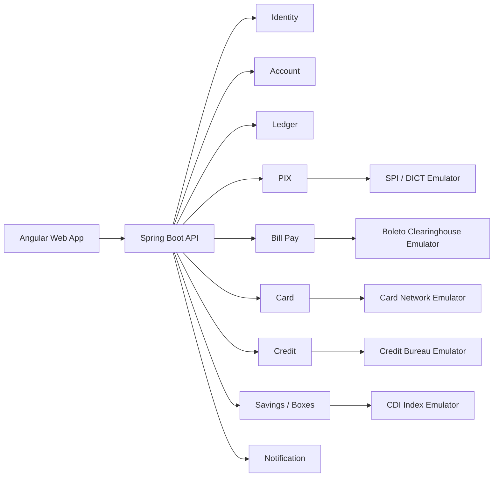
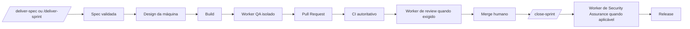
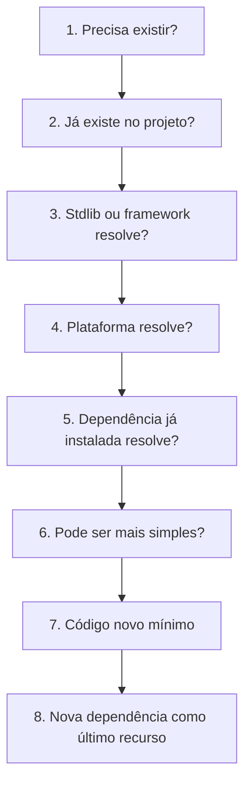

# Guia do Workflow RELAY

> Manual operacional de engenharia: agentes, skills, estados, evidências e operação diária.
>
> Idioma / Language: **Português (pt-BR)** · [English](../en-US/WORKFLOW-GUIDE.md) · [Voltar ao projeto](../../../../README.md)

Aplicação web de banco digital inspirada na experiência dos neobanks brasileiros. O produto é
projetado como um monólito modular com DDD pragmático, Java, Spring Boot, Spring Modulith e
Angular — e construído por uma máquina de entrega orientada por especificações, evidências e
gates executáveis.

Este repositório contém não apenas o produto em construção, mas também sua fonte de verdade:
visão, domínio, arquitetura, roadmap, 17 especificações, decisões e o workflow **RELAY**. A IA
executa o trabalho técnico; o humano decide produto, aceita risco, autoriza operações sensíveis
e faz os merges protegidos.

> **Transparência:** o FKBANK está no início da implementação. A arquitetura, as specs e o
> workflow estão definidos; as funcionalidades do MVP ainda serão entregues sprint a sprint.
> Itens planejados são apresentados como planejados, nunca como concluídos.

---

## Sumário

1. [Status do projeto](#status-do-projeto)
2. [Visão do produto](#visão-do-produto)
3. [Arquitetura](#arquitetura)
4. [Stack principal](#stack-principal)
5. [RELAY: workflow de engenharia](#relay-workflow-de-engenharia)
6. [Agentes, skills e evidências](#participantes)
7. [Tutorial de entrega](#tutorial-de-entrega--machine-first)
8. [CI, segurança e releases](#ci)
9. [Primeiros passos](#primeiros-passos)
10. [Mapa da documentação](#documentação)
11. [Licença](#licença)

## Status do projeto

O FKBANK está no começo da implementação funcional. O **RELAY**, workflow que governa
especificações, planejamento, implementação, QA, Pull Requests, segurança, releases e decisões
humanas, já está instalado e validado como baseline de engenharia.

```text
Estado atual:
baseline documental e workflow RELAY concluídos
→ Sprint 1 pronta para execução
→ SPEC-0016 (observabilidade)
→ SPEC-0001 (ledger)
→ SPEC-0002 (cadastro e conta)
```

Nenhuma funcionalidade deve ser considerada entregue apenas porque existe código. Uma entrega somente é concluída depois de passar pelos gates aplicáveis, abrir Pull Request, receber revisão humana e ser mergeada na branch correta.

---

## Visão do produto

O FKBANK será uma aplicação bancária web com experiência semelhante à de um banco digital.

O MVP está organizado em torno das seguintes capacidades:

- cadastro e abertura de conta;
- autenticação e perfil do usuário;
- conta corrente;
- saldo, extrato e comprovantes;
- PIN transacional;
- transferências internas;
- PIX simulado com integrações de alta fidelidade;
- depósitos e pagamentos por boleto simulados;
- cartão virtual;
- limites transacionais;
- crédito e empréstimo pessoal;
- caixinhas com rendimento;
- notificações;
- privacidade e ciclo de vida dos dados;
- observabilidade, dashboards e alertas.

Os sistemas externos serão representados por emuladores determinísticos. O core da aplicação não deve saber se está conversando com um serviço real ou simulado; essa distinção fica nas URLs e nas camadas anticorrupção.

---

## Arquitetura

O projeto utiliza um **monólito modular**.



### Princípios arquiteturais

- exatamente três pacotes raiz no backend: `domain`, `application` e `infra`;
- um módulo por bounded context abaixo de `domain`;
- dependências acíclicas: `application → domain` e `infra → domain`, nunca o inverso;
- mecanismos de entrega em `application`; implementações técnicas em `infra`;
- DTOs somente nas bordas;
- agregados nunca saem do módulo;
- nenhuma entidade JPA é serializada diretamente;
- ledger central como fonte de verdade financeira;
- saldo derivado dos lançamentos;
- idempotência em toda rota de movimentação;
- locks e transações explícitos em operações concorrentes;
- eventos internos via Spring Modulith;
- integrações externas via ACL;
- transactional outbox para eventos externos;
- segurança default-deny;
- observabilidade desde o walking skeleton;
- testes executados no ambiente em que a regra realmente precisa valer.

---

## Stack principal

### Backend

- Java 21;
- Spring Boot;
- Spring Modulith;
- Spring Data JPA;
- PostgreSQL;
- Flyway;
- Spring Security;
- OAuth2 / OIDC;
- springdoc-openapi;
- Micrometer;
- Testcontainers;
- JUnit 5;
- jqwik;
- ArchUnit;
- PIT.

### Frontend

- Angular;
- standalone components;
- zoneless change detection;
- signals;
- RxJS;
- PrimeNG;
- Tailwind CSS;
- Vitest;
- Playwright.

### Infraestrutura e qualidade

- Docker Compose;
- GitHub Actions;
- Prometheus;
- Grafana;
- Loki;
- Alloy;
- gitleaks;
- CodeQL;
- Dependabot.

As versões exatas e as decisões canônicas devem permanecer em `docs/ARCHITECTURE.md` e nos ADRs.

---

# RELAY: workflow de engenharia

O RELAY é o processo oficial de entrega do FKBANK.

Ele foi criado para impedir:

- sessões longas demais;
- implementação sem requisito claro;
- múltiplos agentes alterando os mesmos arquivos;
- decisões silenciosas;
- dependências desnecessárias;
- QA contaminado pela implementação;
- loops automáticos infinitos;
- merges realizados pela IA;
- perda de contexto entre sessões.

O modelo operacional é uma máquina de estados determinística. Você invoca um comando e o
RELAY avança automaticamente até uma espera externa real, decisão material ou falha.



Cada fase passa o bastão por artefatos persistentes:

```text
spec
→ plano
→ developer verification
→ QA report
→ Pull Request
→ CI
→ relatório de review quando exigido
→ decisão humana
→ fechamento da Sprint e relatório de segurança
```

A memória de uma conversa nunca é a única fonte do contexto.

---

## Participantes

O RELAY possui um agente principal orquestrador/implementador e exatamente três workers
especializados, orquestrados livremente pelo Ultracode: `qa-engineer`, `pr-reviewer` e
`security-assurance-engineer`. O operador não abre nem coordena sessões separadas dos workers.

### Operador humano

O operador é a autoridade final.

Somente o humano precisa:

- resolver ambiguidade material de produto ou arquitetura;
- decidir ambiguidades funcionais;
- aprovar uma nova dependência;
- aprovar mudança arquitetural material;
- aceitar risco;
- fazer merge;
- autorizar release;
- autorizar operação irreversível.

### Agente principal e orquestrador

A sessão normal do Claude Code é o orquestrador e o único implementador ativo. Ela avança a
máquina de estados e orquestra automaticamente as responsabilidades especializadas.

Responsabilidades:

- entrevista;
- especificação;
- análise;
- planejamento;
- implementação;
- TDD;
- testes do desenvolvedor;
- correções;
- documentação;
- commits;
- push da branch de trabalho;
- abertura do Pull Request;
- acompanhamento inicial do CI.

### `qa-engineer`

Responsabilidade independente acionada automaticamente pela orquestração Ultracode.

Responsabilidades:

- testes de aceitação;
- API black-box;
- contratos;
- E2E;
- erros;
- concorrência funcional;
- resiliência;
- evidências;
- test books.

O QA não altera código de produção.

### `pr-reviewer`

Worker isolado e read-only acionado automaticamente quando risco ou evidência exigirem.

Responsabilidades:

- corretude;
- arquitetura;
- segurança do diff;
- banco;
- contratos;
- testes;
- observabilidade;
- riscos;
- foco para a revisão humana.

O reviewer não edita, comenta automaticamente, aprova ou mergeia.

### `security-assurance-engineer`

Worker independente de segurança da entrega final, acionado automaticamente por
`/close-sprint` quando a Sprint contém trabalho R3/R4 ou a política o exige.

Responsabilidades:

- reconciliar o threat model;
- executar SAST e verificações de segredos, dependências e licenças;
- verificar autenticação, autorização e isolamento;
- executar testes negativos, DAST e pentest automatizado em ambiente local/de testes;
- verificar containers e infraestrutura;
- registrar evidências duráveis para o SHA exato do candidato.

O worker de segurança nunca altera código de produção, ataca produção automaticamente, aceita
risco, enfraquece gates, aprova, publica ou faz merge.

---

# Classificação de risco

O processo cresce de acordo com o risco da alteração.

| Risco | Tipo | Exemplos |
|---|---|---|
| R0 | trivial | texto, typo, comentário, metadado |
| R1 | baixo | bug localizado, UI pequena, refatoração reversível |
| R2 | normal | feature comum, backend + frontend, persistência simples |
| R3 | alto | dinheiro, autorização, concorrência, migration, PII |
| R4 | crítico | irreversibilidade, produção, exclusão de dados, impacto regulatório |

## R0/R1 — Fast Track

Toda mudança versionada possui ao menos uma **Light Spec**.

```text
/deliver-spec <id>
→ design leve, build, verificação, PR e CI automáticos
→ revisão humana
→ merge humano
```

## R2 — Standard Relay

```text
/deliver-spec <id>
→ design e validação do plano automáticos
→ build
→ worker QA isolado
→ PR e CI
→ worker de review quando acionado
→ revisão humana
→ merge humano
```

## R3/R4 — Critical Relay

```text
/deliver-spec <id>
→ design durável e validação do plano
→ build
→ worker QA isolado
→ PR e CI
→ worker de review isolado obrigatório
→ revisão humana
→ merge humano
→ /close-sprint aciona security-assurance-engineer
→ release
```

---

# Escada de Decisões

Antes de criar código, o agente deve seguir esta ordem:



A regra não é escrever a menor quantidade de caracteres.

A regra é produzir a menor solução que continue:

- clara;
- correta;
- segura;
- testável;
- observável;
- consistente com a arquitetura.

Nova dependência de produção exige aprovação humana.

---

# Human Decision Gate

Nenhuma dúvida material pode ser resolvida silenciosamente.

O agente deve parar quando houver:

- conflito entre spec e domínio;
- conflito entre spec e ADR;
- regra incompleta;
- mais de uma interpretação válida;
- timezone indefinido;
- arredondamento indefinido;
- permissão incerta;
- erro não especificado;
- nova dependência;
- mudança estrutural;
- expansão de escopo;
- migration destrutiva;
- alteração de contrato público;
- risco não aceito;
- operação irreversível.

Estado:

```text
HUMAN_DECISION_REQUIRED
```

A pergunta deve trazer:

- contexto;
- conflito;
- evidências;
- opções;
- trade-offs;
- recomendação;
- impacto de não decidir.

---

# Estrutura esperada do repositório

```text
/
├── CLAUDE.md
├── README.md
├── docs/
│   ├── PRODUCT.md
│   ├── DOMAIN.md
│   ├── ARCHITECTURE.md
│   ├── ROADMAP.md
│   ├── CHANGELOG.md
│   ├── adr/
│   ├── specs/
│   ├── exec-plans/
│   ├── workflow/
│   ├── security/
│   ├── tests/
│   ├── qa/
│   ├── release-notes/
│   └── manual/
├── .claude/
│   ├── settings.json
│   ├── workflow-policy.yml
│   ├── agents/
│   ├── skills/
│   ├── rules/
│   ├── hooks/
│   ├── templates/
│   └── runtime/
├── tools/
│   ├── quality/
│   ├── workflow/
│   ├── git/
│   └── release/
├── backend/
│   └── src/main/java/com/fkbank/
│       ├── domain/        # bounded contexts, modelo, casos de uso, portas, eventos
│       ├── application/   # API, filas, streams, WebSocket, schedulers
│       └── infra/         # persistência, segurança, mensageria, integrações, config
├── frontend/
├── emulators/
├── infra/                 # assets de deploy/observabilidade, não é pacote Java raiz
└── .github/
    └── workflows/
```

A estrutura real pode evoluir, mas mudanças arquiteturais materiais exigem ADR.

---

# Tutorial de entrega — machine-first

A operação normal é um loop de specs seguido por um único fechamento autônomo:

```text
/deliver-spec <id>       # entrega uma spec até a espera pelo merge humano
/close-sprint <sprint>   # fecha, assegura, prepara e finaliza a release da Sprint

# Atalho opcional e menos comum:
/deliver-sprint <sprint> # entrega todas as specs e executa o mesmo fechamento completo
```

Os comandos granulares abaixo são contratos internos e entradas de recuperação, não uma
cerimônia obrigatória para o operador.

## 1. Planejar a Sprint

A Sprint não é um agente e não começa implementando.

Abra uma sessão normal e use um prompt semelhante:

```text
Estamos iniciando a Sprint 1.

Objetivo de negócio:
[descreva o resultado]

Capacidade aproximada:
[ex.: 20 horas]

Analise PRODUCT.md, DOMAIN.md, ARCHITECTURE.md, ROADMAP.md e as specs existentes.

Não implemente.

Quero:
1. specs candidatas;
2. dependências;
3. risco R0–R4;
4. ordem recomendada;
5. Sprint Goal;
6. itens que não cabem;
7. specs que precisam ser divididas;
8. decisões humanas pendentes;
9. proposta de compromisso da Sprint.

Não assuma regras ausentes.
```

O operador escolhe o compromisso final.

---

## 2. Criar ou revisar uma spec

### Light Spec

```text
/spec --profile light

Corrigir a mensagem exibida quando o usuário informa um CPF inválido.
Não alterar a regra de validação.
```

### Standard ou Critical Spec

```text
/spec --profile critical

Implementar transferência interna entre contas FKBANK com PIN,
Idempotency-Key, recibos e concorrência segura.
Não invente limites que ainda não foram aprovados.
```

A spec deve terminar em um estado conhecido:

```text
AWAITING_SPEC_INPUT
AWAITING_SPEC_APPROVAL
READY
HUMAN_DECISION_REQUIRED
BLOCKED
```

Invocar `/deliver-spec` aprova explicitamente o hash exato da spec validada. Uma dúvida
material ainda interrompe a máquina.

---

## 3. Planejar uma fatia R2+

```text
/design-slice 0007
```

O design deve:

- ler somente o contexto necessário;
- aplicar a Escada de Decisões;
- identificar reuso;
- identificar contratos;
- definir sequência TDD;
- definir foco do QA;
- identificar riscos;
- verificar se a fatia cabe em uma sessão;
- propor divisão quando necessário;
- não alterar código de produção.

Quando toda decisão deriva da spec e da arquitetura aprovadas, a máquina registra
`PLAN_APPROVED` e continua. Somente uma escolha material nova interrompe.

---

## 4. Aprovação de plano legado/recuperação

```text
/approve-plan 0007
```

Esse comando existe apenas para recuperação de estado legado. O registro contém:

- data;
- operador;
- versão do plano;
- observações;
- decisões.

Resultado:

```text
PLAN_APPROVED
```

---

## 5. Implementar

A orquestração normal entra no build automaticamente. Para recuperação manual:

```text
/build 0007
```

O builder deve:

- criar ou validar a branch;
- trabalhar em TDD;
- executar testes focados;
- criar checkpoints coerentes;
- não reabrir decisões aprovadas sem evidência;
- parar diante de desvio material;
- executar a verificação final;
- gerar `dev-verification.md`.

Resultado:

```text
DEV_VERIFIED
```

### Branches

```text
chore/<id>-<slug>
bugfix/<id>-<slug>
feature/<id>-<slug>
release/<version>
hotfix/<version>-<slug>
```

Nunca implemente diretamente em `develop` ou `main`.

---

## 6. Executar QA

`/deliver-spec` aciona a responsabilidade independente `qa-engineer` pelo workflow Ultracode. `/qa`
fica disponível apenas para recuperação ou diagnóstico.

### Passagem 1 — black-box

O QA testa a spec sem ler a implementação.

### Passagem 2 — white-box

Depois de congelar os resultados black-box, o QA lê o diff, os testes e os contratos.

Resultados:

```text
PASS
PASS_WITH_OBSERVATIONS
FAIL_REWORK
HUMAN_DECISION_REQUIRED
BLOCKED
```

### Rework

Se houver `FAIL_REWORK`, a orquestração executa o rework limitado e aciona QA mais uma vez.

O segundo FAIL encerra a automação:

```text
BLOCKED
```

---

## 7. Abrir Pull Request

Depois do QA:

```text
/pr 0007
```

A skill executa:

- DoD pré-PR;
- atualização documental;
- changelog;
- push;
- criação da PR;
- observação limitada do CI;
- DoD pós-PR.

Estados possíveis:

```text
PR_OPEN
CI_PENDING
CI_FAILED
AWAITING_HUMAN_REVIEW
HUMAN_DECISION_REQUIRED
BLOCKED
```

---

## 8. Revisar o PR

Para R3/R4, `/deliver-spec` aciona automaticamente o reviewer isolado e read-only. Em riscos
menores, ele é acionado por política ou evidência. `/review-pr` fica como entrada de recuperação.

O relatório não substitui a revisão humana.

---

## 9. Fazer merge

O merge é sempre humano.

Antes de mergear:

- CI verde;
- QA aceitável;
- findings avaliados;
- documentação coerente;
- decisões registradas;
- nenhuma limitação escondida;
- rollback entendido.

Depois do merge humano, o fechamento da entrega é automático. A próxima invocação de `/deliver-spec`
— ou `/close-sprint` / `/release` para a última fatia da Sprint — começa varrendo qualquer fatia já
mergeada mas ainda não reconciliada: vira o frontmatter da spec para `IMPLEMENTED` com
`implemented_at` no instante real do merge, marca a linha em `docs/ROADMAP.md` como `Done ☑` com
`Completed` e move o plano durável de `docs/exec-plans/active/` para `docs/exec-plans/completed/`. O
`/reconcile-workflow` permanece apenas como fallback manual — para a última fatia, entregas fora de
banda ou correção de desvio:

```text
/reconcile-workflow 0007
```

---

# CI

O CI é a autoridade automatizada para gates determinísticos.

Gates esperados:

- backend build;
- testes;
- ArchUnit;
- cobertura;
- mutation testing quando aplicável;
- OpenAPI drift;
- frontend lint;
- frontend tests;
- frontend build;
- E2E;
- gitleaks;
- CodeQL;
- dependências.

Um gate que ainda não existe deve ser declarado como:

```text
PLANNED
```

ou:

```text
NOT_APPLICABLE
```

Nunca como aprovado.

---

# Releases

Durante desenvolvimento:

```text
1.5.0-SNAPSHOT
```

Na release:

```text
1.5.0
```

Depois:

```text
1.6.0-SNAPSHOT
```

Features não alteram a versão da aplicação.

## Preparar release

```text
/release 1.5.0
```

Fluxo:

```text
develop
→ release branch
→ versão de release
→ changelog
→ release notes
→ verify-release
→ PR para main
→ merge humano
```

## Finalizar release

Após o merge em `main`:

```text
/release 1.5.0
```

A fase de finalização:

- verifica o SHA;
- cria tag;
- cria GitHub Release;
- avança para o próximo SNAPSHOT;
- abre PR de sincronização para `develop`.

---

# Hotfix

Hotfix começa em `main`, mas continua respeitando fases e gates.

```text
scope
→ build
→ QA aplicável
→ PR para main
→ merge humano
→ tag/release
→ PR de sincronização
```

Nenhuma skill atravessa um merge humano.

Hotfix crítico não recebe `SECURITY_VERIFIED` por simples aceitação de risco.

---

# Comandos do RELAY

| Comando | Finalidade |
|---|---|
| `/deliver-spec` | primeiro reconcilia automaticamente qualquer fatia anterior já mergeada e não reconciliada, depois avança uma spec até a espera pelo merge humano |
| `/deliver-sprint` | loop opcional da Sprint inteira: avança todas as specs e executa `/close-sprint` internamente |
| `/close-sprint` | comando normal pós-specs: reconcilia, fecha, assegura, prepara e finaliza a release; após merge protegido, retome o mesmo comando |
| `/security-assurance` | entrada interna/recuperação do worker de segurança pesada |
| `/spec` | cria ou refina uma especificação |
| `/design-slice` | cria o plano da fatia |
| `/approve-plan` | recuperação exclusiva de estado legado `AWAITING_PLAN_APPROVAL` persistido |
| `/build` | implementa e verifica |
| `/qa` | executa QA independente |
| `/pr` | prepara e abre Pull Request |
| `/review-pr` | revisa PR em modo read-only |
| `/fix-pr` | executa uma rodada de correção |
| `/release` | entrada especializada para releases fora do fluxo; a release normal da Sprint é interna ao `/close-sprint` |
| `/hotfix` | conduz hotfix em estágios |
| `/workflow-status` | consulta estado sem alterar arquivos |
| `/reconcile-workflow` | fallback manual que reconcilia a última fatia ou desvios; o fechamento de rotina é automático no próximo `/deliver-spec`, `/close-sprint` ou `/release` |
| `/adr` | registra decisão arquitetural |
| `/spike` | investigação timeboxed |
| `/impact` | análise read-only limitada |

---

# Estados principais

O caminho machine-first normal usa os estados abaixo. `AWAITING_PLAN_APPROVAL` existe somente
para recuperação de estado legado por `/approve-plan`; execuções novas validam planos derivados
automaticamente e podem emitir `PLAN_APPROVED` sem cerimônia humana.

```text
DRAFT
AWAITING_SPEC_INPUT
AWAITING_SPEC_APPROVAL
READY
DESIGNING
PLAN_APPROVED
BUILDING
DEV_VERIFIED
QA_RUNNING
QA_VERIFIED
QA_OBSERVATIONS
QA_REWORK
PR_PREPARING
PR_OPEN
CI_PENDING
CI_FAILED
AWAITING_HUMAN_REVIEW
REVIEW_PASSED
REVIEW_FINDINGS
AWAITING_HUMAN_MERGE
SPRINT_DELIVERED
SPRINT_CLOSED
SECURITY_NOT_APPLICABLE
SECURITY_VERIFIED
SECURITY_OBSERVATIONS
AWAITING_RISK_ACCEPTANCE
AWAITING_PRODUCTION_AUTHORIZATION
EXTERNAL_SYSTEM_UNAVAILABLE
HUMAN_DECISION_REQUIRED
BLOCKED
```

Cada transição registra estado e evidência. A orquestração normal continua automaticamente.

Exemplo:

```text
AWAITING_HUMAN_MERGE
resume: /deliver-spec 0007 --resume
```

---

# Consultar o estado

```text
/workflow-status
```

ou:

```text
/workflow-status 0007
```

O status deve apresentar:

- spec;
- risco;
- fase;
- branch;
- PR;
- QA;
- CI;
- decisões pendentes;
- próximo comando.

---

# Hard stop

O fluxo para automaticamente quando:

- a mesma falha se repete;
- QA falha pela segunda vez;
- CI falha novamente depois da correção permitida;
- a spec é ambígua;
- há conflito entre fontes;
- o plano não cabe em uma sessão;
- uma mudança estrutural não foi aprovada;
- uma operação é irreversível;
- um gate obrigatório não existe ou não pode ser executado.

O resultado deve ser um Block Report, não uma tentativa infinita.

---

# Fechamento da Sprint

Ao final da Sprint, execute `/close-sprint <sprint>`. Esse é o único comando rotineiro após as specs.
Ele varre qualquer fatia já mergeada mas ainda
não reconciliada — o caso da última fatia da Sprint, que não tem `/deliver-spec` posterior para
acioná-la — para `IMPLEMENTED` no instante real do merge (ROADMAP `Done ☑` + `Completed`, plano
durável movido para `docs/exec-plans/completed/`), reconcilia evidências, roda a verificação de
release, aciona Security Assurance automaticamente quando aplicável, grava um relatório durável
conciso, prepara a release e segue até a finalização. Ele nunca transfere o operador para
`/release`. Os merges de branches protegidas continuam humanos; depois deles, retome o mesmo
`/close-sprint`. O relatório registra resultados auditáveis e exceções, não um diário obrigatório
de fases, tokens ou compactações.

```text
Estamos fechando a Sprint.

Analise:
- Sprint Goal;
- specs comprometidas;
- merges em develop;
- PRs abertas;
- QA;
- CI;
- bugs;
- rework;
- decisões;
- bloqueios ou gates dispensados.

Produza:
1. objetivo alcançado ou não;
2. concluídos;
3. incompletos;
4. carry-over;
5. findings;
6. verificação e veredito de Security Assurance.
```

Uma spec só é considerada entregue depois de mergeada com os gates aplicáveis.

---

# Regra dos 20%

Uma etapa deve ser revista quando:

```text
overhead mediano > 20%
e
nenhuma melhoria mensurável de qualidade, risco ou rework
```

O workflow é obrigatório, mas não é imutável. Mudanças precisam de evidência e aprovação.

---

# Primeiros passos

Depois de clonar o projeto:

1. leia `CLAUDE.md`;
2. leia `docs/workflow/SETUP.md`;
3. execute os smoke tests;
4. revise `PRODUCT.md`;
5. revise `DOMAIN.md`;
6. revise `ARCHITECTURE.md`;
7. resolva decisões humanas pendentes;
8. aprove a primeira spec;
9. planeje a Sprint;
10. comece pela primeira fatia aprovada.

No Windows:

```powershell
powershell.exe -NoProfile -ExecutionPolicy Bypass -File tools/tests/relay-smoke.ps1
```

No Linux/macOS:

```bash
timeout 300 tools/tests/relay-smoke.sh
```

Não inicie uma Sprint se os smoke tests falharem.

---

# Documentação

| Documento | Papel |
|---|---|
| `CLAUDE.md` | regras permanentes para o agente |
| `docs/PRODUCT.md` | visão e escopo do produto |
| `docs/DOMAIN.md` | linguagem e invariantes do domínio |
| `docs/ARCHITECTURE.md` | arquitetura aprovada |
| `docs/ROADMAP.md` | ordem provável de capacidades |
| `docs/specs/` | comportamento das funcionalidades |
| `docs/adr/` | decisões arquiteturais |
| `docs/workflow/` | workflow e relatórios |
| `docs/security/` | Security Assurance |
| `docs/manual/` | manual do usuário |
| `docs/release-notes/` | notas de release |

---

# Contribuição

Este projeto é desenvolvido com auxílio de IA, mas decisões, responsabilidade e merges continuam humanos.

Antes de alterar código:

- exista uma spec;
- exista uma branch;
- o risco esteja classificado;
- o plano esteja aprovado quando aplicável;
- não existam decisões materiais pendentes.

Antes de abrir PR:

- testes passam;
- verificação está registrada;
- QA aplicável foi executado;
- documentação foi atualizada;
- limitações estão explícitas.

---

# Licença

Este projeto é distribuído sob a [BSD Zero Clause License (0BSD)](../../../../LICENSE).
